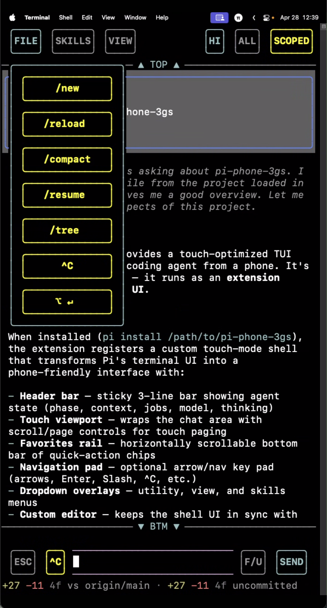

# pi-phone-3gs

> A touch-optimized TUI shell that runs inside Pi, designed for driving a coding agent from a phone.



`pi-phone-3gs` is a Pi package that replaces Pi's default chrome with a phone-first touch interface — big buttons, scrollable overlays, a favorites rail, and viewport controls — all inside the same terminal session running on your real machine.

The idea: you SSH into your Mac from your phone, open Pi, and the UI is actually usable at thumb-width.

## What it does

When enabled, the extension installs a custom TUI layout on top of Pi's existing session:

- **Sticky header bar** — shows agent phase (idle / thinking / streaming / tool-calling), current model, thinking level, and tap-to-toggle dropdown buttons
- **Dropdown overlays** — FILE (utility commands), PRMPT (prompt templates), SKILLS (skill commands), VIEW (toggle switches), SCOPED / ALL (model selectors) — all with scroll, drag, and tap support
- **Scrollable viewport** — wraps the chat area with page-up / page-down / top / bottom controls and kinetic drag scrolling
- **Favorites rail** — horizontally scrollable bottom bar of quick-access buttons (customizable via JSON)
- **Nav pad** — optional arrow-key / enter / escape / interrupt pad for fine-grained input
- **Editor controls** — optional top-of-editor buttons for send, stash, follow-up, escape, interrupt

Everything is driven by touch (mouse events over SSH) or keyboard. No web UI, no chat bot, no proxy — just the terminal, redesigned for thumbs.

## Install

From a local checkout:

```bash
pi install /absolute/path/to/pi-phone-3gs
```

From git:

```bash
pi install git:git@github.com:xXJSONDeruloXx/pi-phone-3gs
```

Then inside Pi:

```text
/reload
```

The package auto-enables phone-shell mode on first load by seeding starter config/layout/favorites/state files under `~/.pi/agent/pi-phone-3gs/`. Existing user files are never overwritten on later updates.

## Commands

| Command | What it does |
|---|---|
| `/phone-shell on\|off\|toggle` | Enable or disable the touch shell |
| `/touch` | Quick toggle alias |
| `/phone-shell status` | Show current state, overlay visibility, loaded resources |
| `/phone-shell reload-config` | Re-read config/layout/favorites from disk |
| `/phone-shell show-config` | Print the active config JSON |
| `/phone-shell show-layout` | Print the active layout JSON |
| `/phone-shell config-template` | Print the default config template |
| `/phone-shell layout-template` | Print the default layout template |
| `/phone-shell favorites-template` | Print the default favorites template |
| `/phone-shell paths` | Show all file paths used by the shell |
| `/phone-shell log` | Show the last N lines of the debug log |
| `/phone-shell top\|bottom\|page-up\|page-down` | Viewport scroll commands |
| `Ctrl+1` | Toggle shortcut (keyboard) |

## Header buttons

The 3-line header bar contains these tap targets, left to right:

**Left group:** FILE · PRMPT · SKILLS · VIEW

**Right group:** THINKING · ALL · SCOPED

| Button | Action |
|---|---|
| FILE | Toggle the utility dropdown (`/new`, `/reload`, `/compact`, `/resume`, `/tree`, `^C`, follow-up) |
| PRMPT | Toggle the prompts dropdown (lists available prompt templates from `pi.getCommands()` where `source === "prompt"`) |
| SKILLS | Toggle the skills dropdown (lists available skills from `pi.getCommands()` where `source === "skill"`) |
| VIEW | Toggle the view menu (show/hide toggles for: editor top, stash, send, follow-up, esc, interrupt, favorites rail, nav pad, jump buttons, pi footer) |
| THINKING | Cycle thinking level (OFF → MIN → LOW → MED → HI → XHI) |
| ALL | Open the all-models dropdown (every model with configured auth) |
| SCOPED | Open the scoped-models dropdown (models matching `enabledModels` in settings) |

Each dropdown is scrollable (wheel or drag), anchors under its header button, and auto-dismisses when you tap outside it. Opening one closes any other that's open.

## Customization

Per-user files live at `~/.pi/agent/pi-phone-3gs/`:

| File | Controls |
|---|---|
| `phone-shell.config.json` | Viewport paging, overlay stay-open behavior, kinetic scroll tuning, render spacing, input keybindings |
| `phone-shell.layout.json` | Utility button list and bottom panel button groups |
| `phone-shell.favorites.json` | Favorites rail entries (label + command / action / raw input) |
| `phone-shell.state.json` | Session persistence (enabled, auto-enable, bar/nav visibility, editor button toggles) |

Templates live in `extras/`:

- `phone-shell.config.example.json`
- `phone-shell.layout.example.json`
- `phone-shell.favorites.example.json`
- `settings.phone.example.json`

The config supports a `promptsOverlay` section (same shape as `skillsOverlay`) for controlling whether the prompts dropdown stays open after selecting a prompt.

## Architecture

This is a Pi extension, not a standalone app. It installs custom TUI components into Pi's component tree during `session_start` and tears them down on `session_shutdown`.

Extension source lives in `extensions/phone-shell/` with one file per responsibility:

```
types.ts          — type definitions
defaults.ts       — constants, default config/layout/favorites/state
config.ts         — JSON parsing, validation, persistence, bootstrap
button-helpers.ts — shared button sizing / palette / row-splitting
button-panel.ts   — generic multi-row button group renderer with hit regions
overlay.ts        — generic dropdown overlay renderer
dropdowns.ts      — all dropdown lifecycle, scroll/drag handlers, model/skill/prompt button builders
header.ts         — sticky 3-line header bar + AgentStateTracker
viewport.ts       — TouchViewport (scroll + page + kinetic drag)
bar.ts            — horizontally scrollable favorites rail
nav.ts            — optional arrow/nav key pad
editor.ts         — editor wrapper that keeps shell re-renders in sync
state.ts          — mutable state singleton, render context, shared utilities
input.ts          — mouse/keyboard routing, action dispatch, overlay management
mode.ts           — touch mode enable/disable lifecycle, TUI install/uninstall
commands.ts       — slash command parsing & handlers
layout.ts         — editor container discovery and proxy positioning
mouse.ts          — mouse input parsing, hit testing, visualization
index.ts          — extension entry point (agent events, bootstrap, registration)
```

### Key patterns

- **Render context**: All components receive `PhoneShellRenderContext` — a `{ state, getConfig, getLayout, getFavorites, getTheme }` bag
- **Centralized state**: One mutable `state` object in `state.ts`; components write to it during render, input handlers mutate it directly
- **Batched renders**: `scheduleRender()` via `queueMicrotask` — never call `tui.requestRender()` directly
- **Width safety**: Every `render(width)` must clamp output to exactly `width` visible columns via `padLineToWidth` (truncates + pads + resets ANSI state)
- **Bootstrap-first**: starter files created on first load, never overwritten
- **Config hot-reload**: `/phone-shell reload-config` re-reads JSON from disk without restarting

## Build & test

```bash
npm run check    # tsc --noEmit — type check
npm test         # vitest run — smoke tests for render output and hit regions
```

This is a Pi package — there is no bundle step. Pi loads the TypeScript extension directly at runtime.

After any code change, run `/reload` in pi to pick up the modified extension.

## Docs

- [AGENTS.md](AGENTS.md) — full module map, conventions, width-safety rules, branching workflow
- [docs/vision.md](docs/vision.md) — product vision and design principles
- [docs/architecture.md](docs/architecture.md) — component layers and roles
- [docs/roadmap.md](docs/roadmap.md) — phased build order
- [docs/research.md](docs/research.md) — research notes from Pi and adjacent tools
- [docs/prior-art.md](docs/prior-art.md) — comparison against GSD-2, OpenClaw, etc.
- [docs/assets.md](docs/assets.md) — current assets and references
