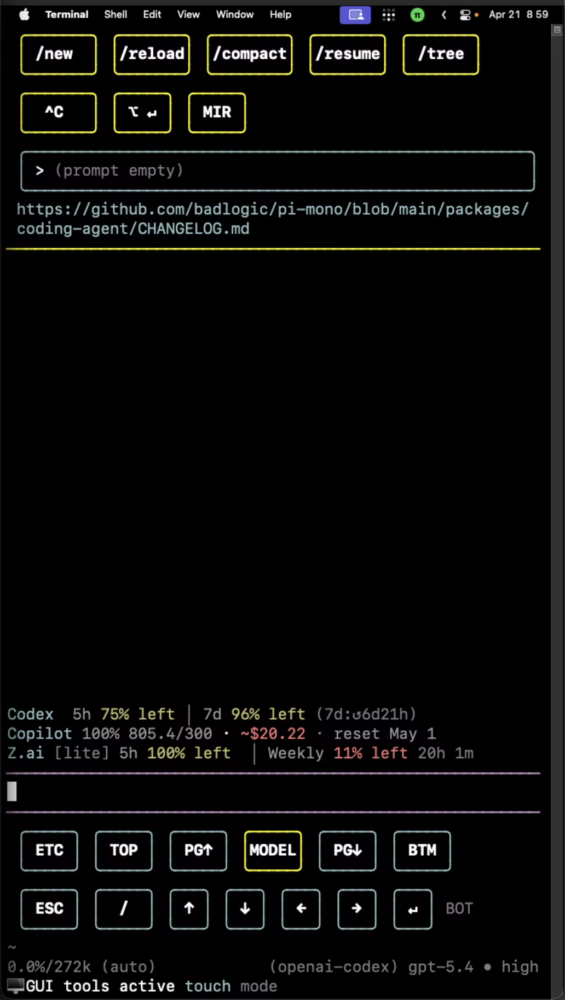

# pi-phone-3gs

> A touch-optimized coding agent harness that still runs in your real terminal on your real computer.



`pi-phone-3gs` is an early vision repo for a phone-first, portrait-friendly coding harness built on top of the Pi ecosystem.

The bet is simple:

- the **computer stays the real computer**
- the **terminal stays the real interface**
- the **phone is just how you remote into it**
- the UI is redesigned so that terminal-native agent work is actually comfortable to drive by touch

## Thesis

A lot of "personal agent" systems move the agent behind a chat abstraction: Telegram, Discord, WhatsApp, Slack, or a web dashboard.

That makes access easy, but it usually waters down the best parts of a serious coding harness:

- direct model control
- rich session state
- tool visibility
- prompt and context steering
- compaction / resume / branch navigation
- the whole moment-to-moment gameplay loop of agentic work

`pi-phone-3gs` takes the opposite approach. The product is the **remote terminal itself**, full-screened on a phone, with large touch targets and a layout tuned for narrow portrait displays.

## Install right now

From a local checkout:

```bash
pi install /absolute/path/to/pi-phone-3gs
```

From git:

```bash
pi install git:git@github.com:xXJSONDeruloXx/pi-phone-3gs
```

Then inside Pi:

```text
/reload
/phone-shell on
```

Primary commands:

- `/phone-shell on|off|toggle`
- `/phone-shell status`
- `/phone-shell reload-config`
- `/phone-shell show-config`
- `/phone-shell show-layout`
- `/phone-shell config-template`
- `/phone-shell layout-template`
- `/phone-shell paths`
- `/touch` — quick toggle alias
- `/pi-touch ...` — compatibility alias
- `Ctrl+1` — toggle shortcut

Per-user override files:

- `~/.pi/agent/pi-phone-3gs/phone-shell.config.json`
- `~/.pi/agent/pi-phone-3gs/phone-shell.layout.json`
- `~/.pi/agent/pi-phone-3gs/phone-shell.state.json`

Templates live in:

- `extras/phone-shell.config.example.json`
- `extras/phone-shell.layout.example.json`
- `extras/settings.phone.example.json`

## Customization model

This package is intentionally built so the core shell can stay clean while per-user tweaks stay outside the code:

- **behavior** lives in `phone-shell.config.json`
- **button layout** lives in `phone-shell.layout.json`
- **session persistence / kill-switch state** lives in `phone-shell.state.json`

The goal is to make it easy to:

- change paging behavior
- reorder buttons
- swap buttons between top utility rail and bottom groups
- add custom command buttons
- keep local experimentation out of the shared package code

## What this project is aiming to be

A dedicated harness, built off Pi in the same spirit that **GSD-2** builds a custom workflow system on top of the Pi SDK, but focused on a different problem:

**make a fully capable coding agent feel good on a phone without giving up terminal-native power.**

Target capabilities include:

- skills
- prompts and prompt templates
- tools
- loops / autonomy modes
- subagents
- browser use
- computer use / GUI automation
- process supervision
- session tree navigation
- compaction / resume
- self-heal and recovery surfaces
- model switching and multi-provider workflows
- dense but touchable status / observability widgets

## What this is not

This repo is explicitly **not** trying to become:

- a web UI
- a proxy to an iPhone app
- a Telegram-bot-first coding agent
- a watered-down remote shell with only a few approved commands
- a chat layer that hides the harness behind another transport abstraction

The core UX is:

1. a home Mac mini or similar machine stays on
2. the machine runs the actual harness in Terminal/iTerm/Ghostty/etc.
3. the display is configured for a portrait-ish phone-friendly viewport
4. you remote in from your phone
5. you operate the harness mostly through a touch-optimized TUI
6. you occasionally pop out to other apps on the host when needed

## Current inspiration sources

This repo is grounded in four concrete references:

1. **Your `pi-personal-package`**
   - especially the experimental `pi-touch` extension and the curated package stack
2. **The current screenshot / prototype direction**
   - large command buttons, viewport controls, model tap target, visible provider usage
3. **`badlogic/pi-mono` and Pi docs**
   - proves the base system is intentionally extensible: SDK, TUI components, skills, extensions, packages, themes
4. **Prior-art harnesses like GSD-2 and OpenClaw**
   - useful examples of what to borrow and what to avoid

## Docs in this repo

- [docs/vision.md](docs/vision.md) — product vision, design principles, gameplay loop, non-goals
- [docs/research.md](docs/research.md) — research notes from Pi, `pi-personal-package`, the screenshot, GSD-2, and OpenClaw
- [docs/architecture.md](docs/architecture.md) — core components, layers, and their roles
- [docs/prior-art.md](docs/prior-art.md) — comparison against Pi, GSD-2, OpenClaw, and adjacent tools
- [docs/assets.md](docs/assets.md) — current assets, references, and reusable building blocks
- [docs/roadmap.md](docs/roadmap.md) — phased build order for turning the vision into a real harness

## Current implementation status

This repo contains a working Pi package with a modular touch shell extension:

- installable via `pi install /path/to/pi-phone-3gs`
- per-user config/layout overrides in `~/.pi/agent/pi-phone-3gs/`
- a sticky header bar with live agent state (phase, context usage, background jobs)
- a scrollable viewport with page up/down controls
- touch-optimized bottom bar and utility overlay

Extension source lives in `extensions/phone-shell/` with one file per responsibility. See [AGENTS.md](AGENTS.md) for the full module map and conventions.

The immediate goal is to make the phone shell real enough to dogfood daily, then iterate from there.
